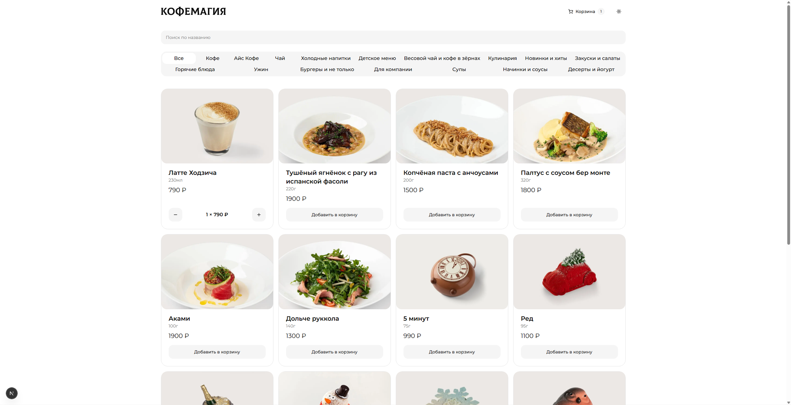
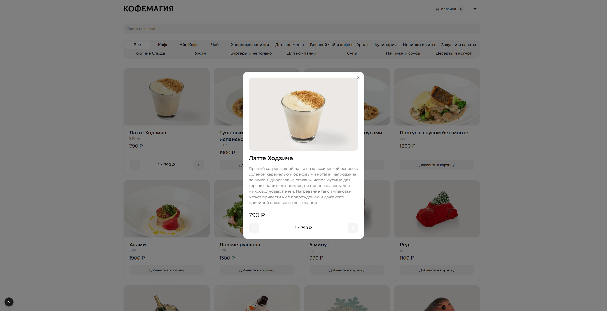
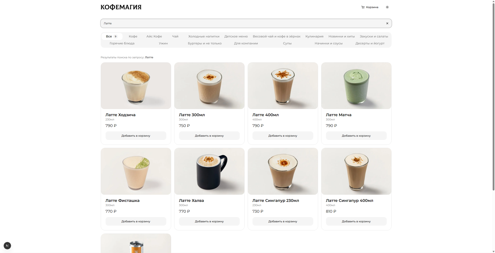
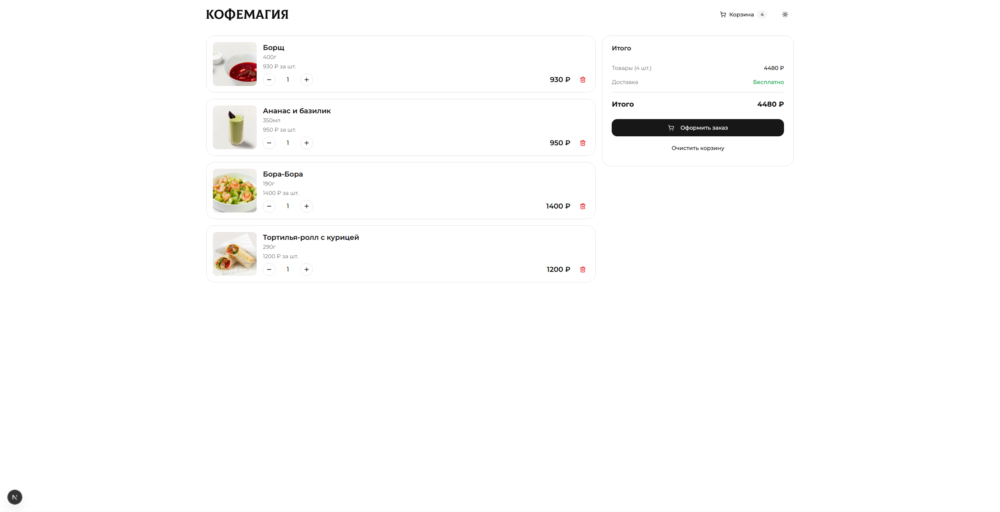

<div align="center">

# ☕ Кофемагия - Ресторан

> **⚠️ Важное уведомление**
>
> Этот проект создан **исключительно в образовательных целях** как тестовое задание для демонстрации навыков веб-разработки.

---

**Современное веб-приложение для заказа еды и напитков**

[](https://nextjs.org/)
[](https://www.typescriptlang.org/)
[](https://tailwindcss.com/)
[](https://ui.shadcn.com/)
[](https://your-project.vercel.app)

[🚀 Демо на Vercel](https://coffeemagia.vercel.app/) • [📝 Установка проекта](#установка)

  
</div>

---

## 📸 Скриншоты

<details>
<summary>Посмотреть все скриншоты</summary>

### 🏠 Главная страница


### 📦 Карточка товара



### 🔍 Поиск товаров



### 🛒 Корзина



</details>

---

## ✨ Функционал

- 🎨 **Современный UI/UX** - Построено на shadcn/ui и Tailwind CSS
- 🔍 **Умный поиск** - Поиск с debounce
- 📑 **Категории** - 16 категорий товаров с фильтрацией
- ♾️ **Infinite Scroll** - Автоматическая подгрузка товаров при скролле
- 🛒 **Корзина** - Zustand store с сохранением в localStorage
- 🌓 **Dark Mode** - Переключение темной/светлой темы
- 📱 **Адаптивный дизайн** - Идеально работает на всех устройствах
- ⚡ **Производительность** - Server Components и оптимизация изображений

---

## 🛠️ Технологии

### Frontend

- **Next.js 16** - App Router, Server Components, Server Actions
- **TypeScript** - Строгая типизация
- **Tailwind CSS** - Utility-first CSS
- **shadcn/ui** - Компонентная библиотека
- **Zustand** - State management

### Инструменты

- **ESLint** - Линтинг кода
- **Prettier** - Форматирование

---

## 🚀 Быстрый старт

### Требования

- Node.js 18+
- npm/yarn/pnpm

### Установка

```bash
# Клонировать репозиторий
git clone https://github.com/adev05/coffeemagia.git
cd coffeemagia

# Установить зависимости
npm install

# Запустить dev сервер
npm run dev
```

Откройте [http://localhost:3000](http://localhost:3000) в браузере.
